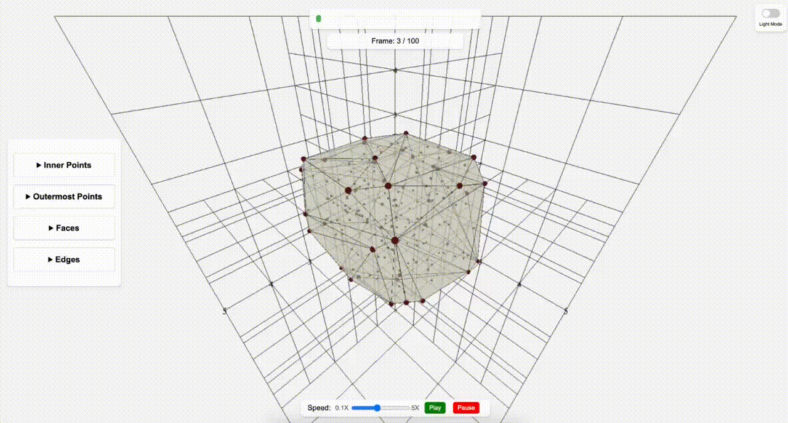

# 3DMesh 🌐📈

Welcome to **3DMesh**, a cutting-edge project focused on developing a comprehensive time series data analysis framework. Our approach integrates advanced machine learning techniques with stunning 3D mesh visualization to tackle a variety of analytical tasks effectively. 

🚀 The system will be capable of addressing various tasks:
- 🚨 Anomaly Detection
- 📈 Time Series Prediction
- 📊 Categorical Classification
- 🌐 Data Clustering
- 📉 Regression Analysis

## Navigating the Project 🗺️

- **[Navigating the Project](#navigating-the-project-🗺️)**
- **[Getting Started](#getting-started-🔧)**
  - [Setting Up](#setting-up)
  - [Running the Application](#running-the-application)
- **[Project Overview](#project-overview-🚀)**
- **[Features and Tools](#features-and-tools-🛠️)**
- **[Future Roadmap and TODOs](#future-roadmap-and-todos-📋)**
- **[Connect with Us](#connect-with-us-🌍)**
- **[License and Use](#license-and-use-📜)**


## Getting Started 🔧

### Setting Up

```bash
pip install -r requirements.txt
```

*Note: Upon the initial launch, npm will auto-install necessary modules.*

### Running the Application

```bash
python app.py
```

## Project Overview 🚀

Completed the followings:

- A robust project structure.
  - **Frontend Magic**: Crafted using Three.JS for immersive visualization 🌌
  - **Backend Strength**: Powered by FastAPI for speedy responses 🚤



**Additional Visualizations by Python Libraries:**  In the `notebooks` directory, discover innovative visualizations crafted using:
- Mayavi - for intricate 3D plotting
- Matplotlib - for classic, reliable graphs

## Features and Tools 🛠️

- 🎨 Artistic Frontend with Three.JS
- ⚡ Efficient Backend using FastAPI
- 🖌️ Custom Visualization Engine for unique insights

## Future Roadmap and TODOs 📋

Here's what we're excited about adding next:

- [x] Convex Hull Creation 📊
- [x] Interactive 3D Controls 📊
- [x] Playback Functionality 📊
- [ ] Import Options for CSV and Excel Files 📥
- [ ] Export Options for PNG, GIFs, etc. 📤
- [ ] Graph Legends for Clarity 📊
- [ ] Enhanced Control Panel for Planes and Axes 🎛️
- [ ] Optimized Mobile and Desktop Experience 📱💻
- [ ] Advanced Interaction Tools (Pan, Zoom, Controllers) 🛠️


## Connect with Us 🌍

Got questions or ideas? Let's talk!

- 📧 **Email:** [mhsnltn@gmail.com](mailto:mhsnltn@gmail.com)
- 🐱 **GitHub:** [@mahsunaltin](https://github.com/mahsunaltin)
- 🔗 **LinkedIn:** [Mahsun ALTIN](https://www.linkedin.com/in/mahsunaltin/)

Your interest and feedback drive us forward! 🌠

## License and Use 📜

This project is under the [LICENSE](LICENSE). Feel free to utilize and adapt our work to your needs.

🎉 **Happy Coding!** 🚀👩‍💻👨‍💻


